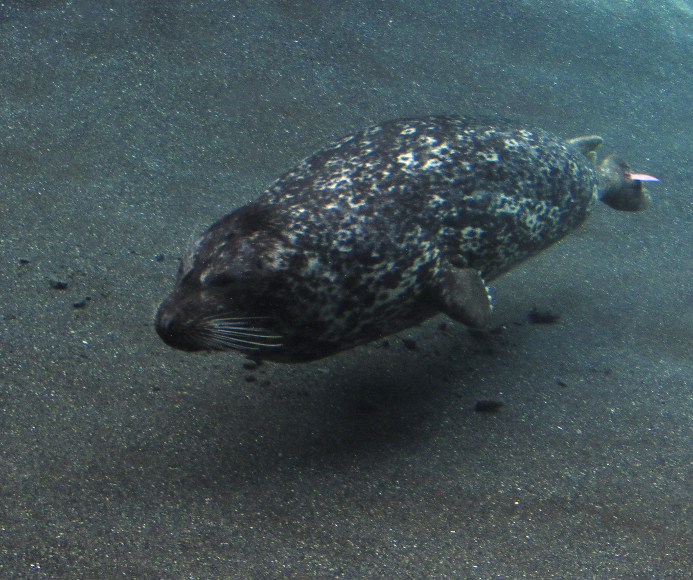
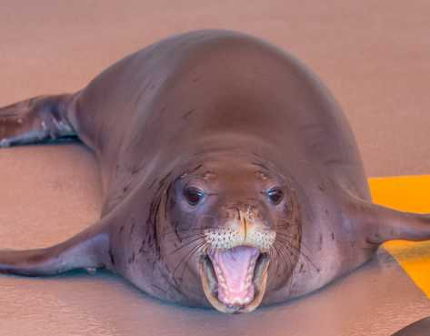
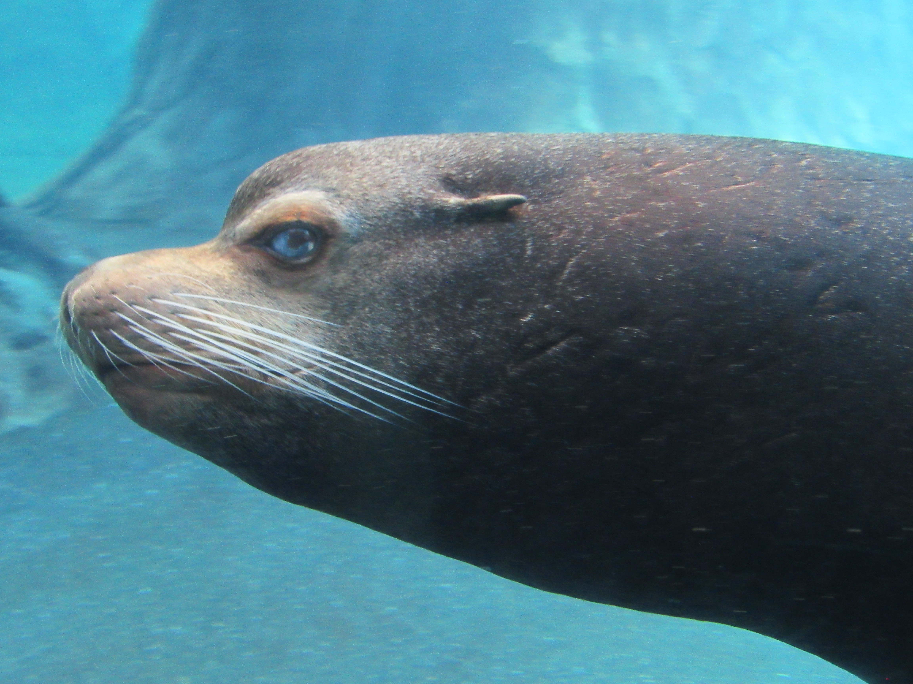

# Perplexing Pinnepeds

Pinnepeds are a clade of mammal that contain 3 super families.

**Odobenidae** - Walrus

**Otariidae** - Fur Seals and Sea Lions

**Phocidae** - Seals

*Walruses are very easy to identify and point out since they have gigantic tusks.*

### Seals or Sea Lion: A Sealious Problem

> Sea Lions and Fur Seals are very similar and the lists of traits below apply for fur seals as well.

| Creature | Trait                                  | 
| :----- | :-----------------------------------------:| 
| Sea Lions     | External Ears| 
|       | Non-fused hip bones |  
|       | "Walk" |
|       | Have elbowa |   
| Seals      | Internal Ears |  
|     | Generally smaller *but not always*|  
|  | Flop or "Galumph" on land |  
|       | Small flippers |  
|      | Claws |  

[More informaiton ](https://oceanservice.noaa.gov/facts/seal-sealion.html)

> Walruses move in a similar way to fur seals and sea lions but they have internal ears.

#### Images/ Examples

Harbor Seal Example 
> You can see the claws very well!
> 

Hawaiian Monk Seal Example
> These seals are very endangered.
> 

Male California Sea Lion
> The ears are very visible here.
> Fun fact! I took this picture.
> 

